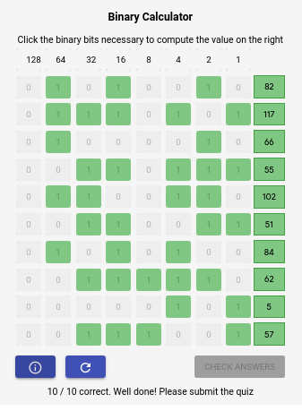

## How to Count in Binary

 

### Question 1

In this activity, you will use the tool below to help you convert a decimal number into binary form. When a 1 is used, we consider the value to be “ON.” When a 0 is used, we consider the value to be “OFF.”

Click the binary bits necessary to compute the decimal value on the right column. You have 10 calculations to complete.

